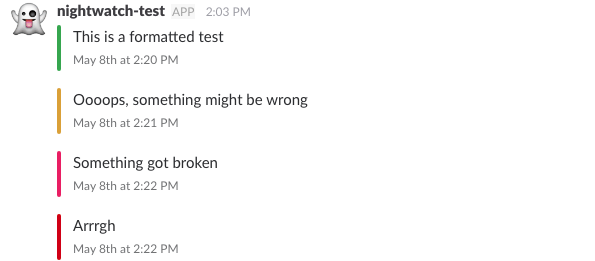

=====
Usage
=====

This package provides a set of feature compatible with the `logging`_ package
from the Python standard library, it's meant to be framework agnostic.

It's currently only supporting Slack but any entity that may receive webhook
could potentially be added later.

Slack
-----

The slack module provide 3 main features to log messages via a Slack Webhook.
By default it simply logs the rendered text of the message messages, but
it's possible to filter only some logs and give a nice styling:

Setup
+++++

Start by setting up an `incoming webhook integration`_ in your Slack team.
You will need to select a channel where you want to post your updates.

Once created, you can customise the icon and name of the bot.

.. note:: You might need to enable "Incoming WebHooks" under custom
          integrations if that's the first one you're setting up

Once you're done, you should get an URL like this:
`https://hooks.slack.com/services/XXXXXXXX/AAAAAAAAA/aaaaaaaaaaaa`

Basic usage
+++++++++++

Once the above is done, you can create a log handler to push to this Webhook.
The bare-bone usage is as below, `URL` being the one obtained at the previous
step:

.. code-block:: python

    from webhook_logger.slack import SlackHandler

    logger = logging.getLogger(__name__)
    logger.setLevel(logging.INFO)
    h = SlackHandler(hook_url=URL)
    h.setLevel(logging.INFO)
    logger.addHandler(h)
    logger.info("Hello World")

This is going to log _everything_ to your channel, which might create a lot
of traffic.

Filtering
+++++++++

Additionally to a logging handler, this package provides a custom log filter,
`SlackLogFilter`, that is only going to push to slack a subset of your logs,
for instance when a user signs up or when a purchase is made.

.. code-block:: python

    from webhook_logger.slack import SlackLogFilter

    h.addFilter(SlackLogFilter())

    # Now this doesn't post in the channel
    logger.info("Hello World")

    # Whereas this does
    logger.info(":wave: Hello World", extra={'notify_slack': True})

Styling
+++++++

If you wish to have a colour bar next to each message reflecting the logging
severity, you need to use the `SlackFormatter` and attach it to your handler. The title parameter is optional.

.. code-block:: python

    from webhook_logger.slack import SlackFormatter

    h.formatter = SlackFormatter(title='Some slack title')

    # Green border
    logger.info("Hello World")

    # Orange border
    logger.warning("Something isn't looking good")

    # Pink border
    logger.error("Hum... Crash here")

    # Red border
    logger.critical("Emergency here!")

Dict config integration
+++++++++++++++++++++++

This package can be used with `dictConfig`_. Here is a config using all the
features described above:

.. code-block:: python

    DICT_CONFIG = {
        'version': 1,
        'disable_existing_loggers': False,
        'filters': {
            'slack_filter': {
                '()': 'webhook_logger.slack.SlackLogFilter',
            }
        },
        'handlers': {
            'slack': {
                'level': 'INFO',
                'filters': ['slack_filter'],
                'class': 'webhook_logger.slack.SlackHandler',
                'hook_url': 'https://hooks.slack.com/services/XXXXXXXX/AAAAAAAAA/aaaaaaaaaaaa',
                'formatter': 'slack_format',
            }
        },
        'formatters': {
            'slack_format': {
                '()': 'webhook_logger.slack.SlackFormatter',
                'title': 'Your optional title'
            },
        },
        'loggers': {
            'my_logger': {
                'handlers': ['slack'],
                'level': 'DEBUG'
            }
        }
    }

Django Integration
++++++++++++++++++

Django loggers are configured using the dictConfig described above, but there
is one additional setting to help if you're using Django, the hook URL may be
configured using a setting:

.. code-block:: python

    SLACK_WEBHOOK_URL = 'https://hooks.slack.com/services/XXXXXXXX/AAAAAAAAA/aaaaaaaaaaaa'

In such case, you can omit the `hook_url` key in the logging config.

.. note:: If this setting is empty, the logging is simply deactivated. That is
          sometimes useful when you only want to post from your production environment.

.. _logging: https://docs.python.org/3/library/logging.html
.. _incoming webhook integration: https://my.slack.com/services/new/incoming-webhook/
.. _dictConfig: https://docs.python.org/3/library/logging.config.html#logging.config.dictConfig
